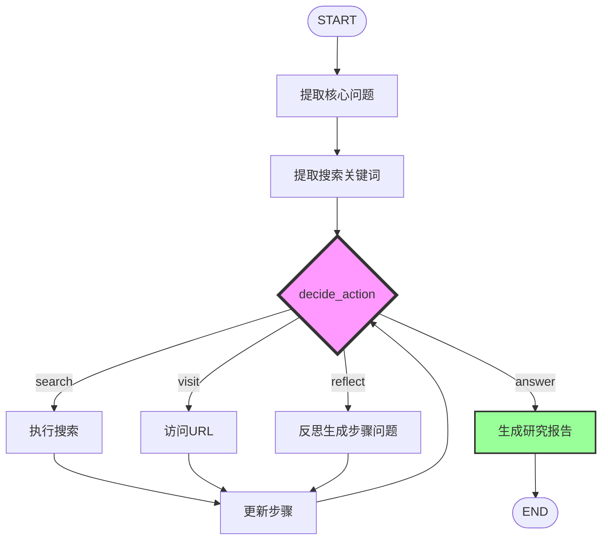
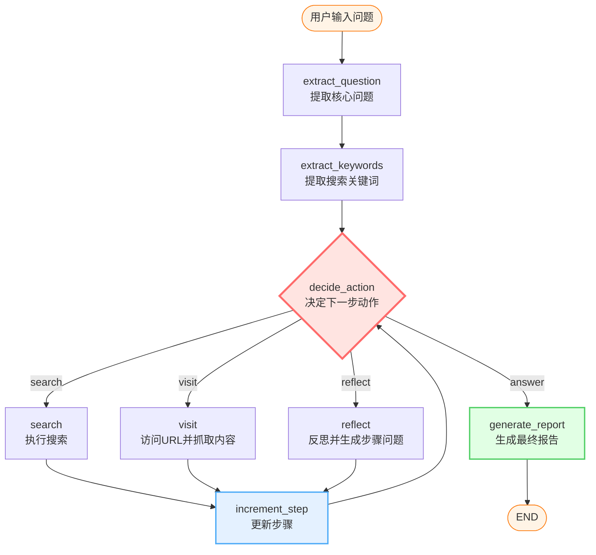

# DeepRAG Pipeline

<div align="center">


🤖 **智能深度研究系统** - 基于LangGraph和DeepSeek的现代化RAG管道

[快速开始](#-快速开始) • [核心特性](#-核心特性) • [架构设计](#-架构设计) • [文档](#-相关文档)

</div>

---

## 📖 项目简介

**DeepRAG Pipeline** 是一个基于 **LangGraph** 构建的智能RAG（Retrieval-Augmented Generation）系统，通过迭代搜索和多代理协作，实现深度研究和结构化报告生成。

### 核心亮点

- 🔄 **LangGraph工作流**: 声明式状态图，清晰的节点和边定义
- 🔍 **迭代深度搜索**: 多轮搜索循环，自动识别信息缺口
- 🤖 **多Agent协作**: 问题提取、关键词生成、研究报告等专业Agent
- 🌐 **实时Web界面**: 现代化聊天界面，流式输出支持
- 📊 **结构化报告**: 自动生成包含引用的专业研究报告

## ✨ 核心特性

### 🔍 **深度搜索引擎**
- **迭代搜索循环**: 搜索 → 访问 → 反思 → 继续/结束
- **智能步骤问题生成**: 自动识别信息缺口，生成针对性查询
- **提前终止机制**: LLM智能判断信息充足度，使用`<sufficient>`标签
- **URL智能排序**: 多因子评分算法，优先访问高质量网页
- **并发内容抓取**: 异步批量抓取，最多10个并发

### 🤖 **LangGraph工作流**
- **状态管理**: TypedDict定义，`Annotated[List, add]`自动合并
- **8个核心节点**: 提取问题 → 提取关键词 → 搜索 → 访问 → 反思 → 生成报告
- **条件路由**: 智能决策下一步动作，支持循环和终止
- **流式输出**: 实时查看每个节点的执行结果
- **可视化**: 自动生成工作流Mermaid图

### 🧩 **AI代理架构**
- **QuestionExtractor**: 从复杂描述中提取核心问题
- **KeywordExtractor**: 生成最适合搜索的关键词
- **ResearchAgent**: 生成结构化研究报告，带内联引用
- **QAAgent**: 问答处理，支持置信度评估
- **AgentManager**: 统一管理和调度所有Agent

### 🛠️ **技术栈**
- **工作流引擎**: LangGraph 0.0.20+ / LangChain Core 0.1.0+
- **LLM**: DeepSeek API (deepseek-chat模型)
- **搜索工具**: Serper.dev (Google搜索API)
- **网页抓取**: Jina Reader API (智能内容提取)
- **Web框架**: Flask + 异步处理
- **缓存系统**: 智能缓存机制

### 🌐 **用户界面**
- **聊天界面**: 现代化UI，实时进度显示
- **管理后台**: 系统监控、缓存管理、配置查看
- **API接口**: RESTful API，支持批量处理

## 🏗️ 架构设计

### LangGraph工作流图



### 目录结构

```
DeepRAG Pipeline/
├── src/                        # 源代码
│   ├── graph/                  # LangGraph工作流
│   │   ├── state.py           # 状态定义 (ResearchState)
│   │   ├── nodes.py           # 8个核心节点
│   │   ├── edges.py           # 路由逻辑
│   │   ├── graph.py           # 图构建
│   │   └── workflow.py        # 高层API
│   │
│   ├── agents/                 # AI代理模块
│   │   ├── base.py            # 基础Agent类
│   │   ├── agent_manager.py   # Agent管理器
│   │   ├── question_extractor.py
│   │   ├── keyword_extractor.py
│   │   ├── research_agent.py
│   │   └── qa_agent.py
│   │
│   ├── search/                 # 搜索工具层
│   │   ├── serper_search.py   # Serper搜索引擎
│   │   ├── jina_reader.py     # Jina网页抓取
│   │   └── cache.py           # 缓存管理
│   │
│   ├── llm/                    # LLM接口层
│   │   ├── base.py            # 基础LLM类
│   │   ├── deepseek.py        # DeepSeek实现
│   │   └── factory.py         # LLM工厂
│   │
│   ├── web/                    # Web界面
│   │   ├── app.py             # Flask应用
│   │   ├── api.py             # API路由
│   │   └── templates/         # HTML模板
│   │
│   └── config.py               # 配置管理
│
├── app.py                      # 主程序入口
├── config.json                 # 配置文件
├── requirements.txt            # 依赖包
└── run_web.bat                # Windows启动脚本
```

## ⚡ 快速开始

### 1. 安装依赖
```bash
# 创建虚拟环境
python -m venv .venv
.venv\Scripts\activate  # Windows

# 安装依赖
pip install -r requirements.txt
```

### 2. 配置API密钥

**方法A: 环境变量（推荐）**
```cmd
set DEEPSEEK_API_KEY=your_deepseek_api_key_here
set SERPER_API_KEY=your_serper_api_key_here
set JINA_API_KEY=your_jina_api_key_here
```

**方法B: 配置文件**
编辑 `config.json` 文件：
```json
{
  "llm": {
    "api_key": "your_deepseek_api_key_here"
  },
  "search": {
    "serper_api_key": "your_serper_api_key_here",
    "jina_api_key": "your_jina_api_key_here"
  }
}
```

### 3. 启动系统

**Web界面模式**
```bash
# 方式1: 使用批处理文件（Windows）
run_web.bat

# 方式2: 直接运行
python app.py

# 方式3: 指定端口和主机
python app.py --host 0.0.0.0 --port 8080

# 方式4: 启用调试模式
python app.py --debug
```

## 💡 使用方法

### Web界面
启动后访问 http://127.0.0.1:5000

## 🔧 高级配置

### 配置文件详解
```json
{
  "llm": {
    "provider": "deepseek",           // LLM提供商
    "api_key": "",                    // API密钥
    "model_name": "deepseek-chat",    // 模型名称
    "max_tokens": 8192,               // 最大token数（1-8192）
    "temperature": 0.3,               // 温度参数（0-2）
    "timeout": 120                    // 超时时间（秒）
  },
  "search": {
    "engine": "deep_search",          // 搜索引擎类型
    "serper_api_key": "",             // Serper API密钥
    "jina_api_key": "",               // Jina API密钥（可选）
    "max_results": 15,                // 每轮最大搜索结果数
    "max_rounds": 3,                  // 最大搜索轮次
    "max_urls_per_step": 10,          // 每步最大访问URL数
    "token_budget": 80000,            // Token预算
    "allow_early_termination": true   // 允许提前结束
  },
  "cache": {
    "enabled": true,                  // 是否启用缓存
    "ttl": 3600,                      // 缓存时间(秒)
    "max_size": 1000                  // 最大缓存条目数
  },
  "log": {
    "level": "INFO",                  // 日志级别
    "format": "...",                  // 日志格式
    "file": "logs/rag_system.log"     // 日志文件
  }
}
```

### 环境变量
- `DEEPSEEK_API_KEY`: DeepSeek API密钥
- `LLM_PROVIDER`: LLM提供商 (默认: deepseek)
- `DEBUG`: 调试模式 (true/false)
- `LOG_LEVEL`: 日志级别 (DEBUG/INFO/WARNING/ERROR)

## 🎯 工作流程详解

### LangGraph执行流程



### 典型执行序列

**第1轮（初始搜索）**
1. `extract_question`: "什么是LangGraph？" → "LangGraph的核心概念和用途"
2. `extract_keywords`: "LangGraph 工作流 状态图"
3. `decide_action`: → `search`
4. `search`: 调用Serper API，获取15个搜索结果
5. `increment_step`: 步骤+1
6. `decide_action`: → `visit`
7. `visit`: 并发访问前10个URL，使用Jina Reader抓取内容
8. `increment_step`: 步骤+1

**第2轮（深度搜索）**
9. `decide_action`: → `reflect`
10. `reflect`: LLM分析已有信息，生成步骤问题："LangGraph与LangChain的关系？"
11. `increment_step`: 步骤+1，轮次+1
12. `decide_action`: → `search`
13. `search`: 使用步骤问题搜索
14. `visit`: 访问新的URL
15. `increment_step`: 步骤+1

**第3轮（完成或继续）**
16. `decide_action`: → `reflect`
17. `reflect`: LLM判断信息充足，返回`<sufficient>`标签
18. `decide_action`: 检测到提前终止 → `generate_report`
19. `generate_report`: Research Agent生成结构化报告
20. `END`: 返回最终结果

### 核心机制

#### 1. 状态管理（ResearchState）
```python
{
    "original_query": "用户原始问题",
    "extracted_question": "提取的核心问题",
    "keywords": "搜索关键词",
    "current_round": 2,                    # 当前轮次
    "current_step": 5,                     # 当前步骤
    "search_results": [...],               # 累积的搜索结果
    "content_results": [...],              # 累积的网页内容
    "step_questions": ["步骤问题1", ...],  # 待搜索问题队列
    "next_action": "search",               # 下一步动作
    "early_termination": False,            # 是否提前结束
    "current_tokens": 25000,               # 当前token消耗
    "final_answer": "..."                  # 最终报告
}
```

#### 2. 条件路由（route_action）
```python
def route_action(state):
    # 终止条件检查
    if state["early_termination"]:
        return "generate_report"
    if state["current_step"] >= state["max_steps"]:
        return "generate_report"
    if state["current_tokens"] >= state["token_budget"]:
        return "generate_report"
    
    # 根据next_action路由
    return {
        "search": "search",
        "visit": "visit",
        "reflect": "reflect",
        "answer": "generate_report"
    }[state["next_action"]]
```

#### 3. 步骤问题生成（Gap Questions）
- **自动识别信息缺口**: LLM分析已收集信息，识别缺失部分
- **生成针对性查询**: 每轮生成1个最重要的步骤问题
- **智能提前结束**: 使用`<sufficient>`标签判断信息充足度
- **深度优先策略**: 深入挖掘某个主题，而非广度覆盖

#### 4. Research Agent报告生成
- **结构化报告**: 包含概述、主要发现、详细分析、结论
- **内联引用**: 格式 `某个观点[^1]`，末尾列出参考来源
- **Markdown格式**: 清晰的标题层次、列表、加粗
- **智能截断**: 单页1000字符，总上下文10000字符

## 📊 系统监控

### Web管理界面功能
- 📈 **系统状态**: 实时监控各组件状态
- 💾 **缓存管理**: 查看和管理缓存统计
- 🧪 **系统测试**: 一键测试所有组件
- 📝 **批量处理**: Web界面批量处理问题
- 📋 **配置查看**: 查看当前系统配置

## 🚀 部署选项

### 本地开发
```bash
python app.py --debug
```

### 生产部署
```bash
python app.py --host 0.0.0.0 --port 8080
```

### Docker部署 (可选)
```dockerfile
FROM python:3.9-slim
WORKDIR /app
COPY requirements.txt .
RUN pip install -r requirements.txt
COPY . .
EXPOSE 5000
CMD ["python", "app.py", "--host", "0.0.0.0"]
```

## 🔍 API接口

### REST API端点
- `POST /api/ask` - 单个问题问答
- `POST /api/batch` - 批量问题处理
- `GET /api/test` - 系统测试
- `GET /api/info` - 系统信息
- `POST /api/cache/clear` - 清理缓存
- `GET /api/health` - 健康检查

### API使用示例
```python
import requests

# 提问
response = requests.post('http://localhost:5000/api/ask', json={
    'question': '什么是人工智能？',
    'use_cache': True
})

result = response.json()
print(result['data']['answer'])
```

## 🛠️ 故障排除

### 常见问题

**1. API密钥错误**
```bash
# 检查环境变量
echo %DEEPSEEK_API_KEY%

# 或检查配置文件
python app.py cli config
```

**2. 依赖包问题**
```bash
# 重新安装
pip install -r requirements.txt --upgrade

# 清理缓存重装
pip cache purge
pip install -r requirements.txt
```

**4. 端口占用**
```bash
# 使用其他端口
python app.py web --port 8080
```

## 📈 性能优化

### 搜索性能
- ⚡ **并发URL抓取**: 异步批量抓取，最多10个并发
- 🎯 **智能URL选择**: 多因子评分，优先访问高质量网页
- 📊 **内容截断**: 单页1000字符，总上下文10000字符
- 🔄 **Token预算管理**: 自动控制搜索深度，避免超预算

### 系统性能
- 💾 **智能缓存**: 自动缓存搜索结果和LLM响应
- 🔧 **错误恢复**: 多层降级处理，URL抓取失败自动重试
- ⏱️ **超时控制**: 合理的超时设置，避免长时间等待
- 📉 **内容审核**: 自动过滤触发DeepSeek审核的内容

### 典型性能指标
- **搜索耗时**: 5-6分钟（3轮搜索，约30个URL）
- **URL抓取**: 60-80秒/10个URL
- **报告生成**: 30-60秒
- **总Token消耗**: 约50K-80K tokens

## 🤝 贡献指南

1. Fork 项目
2. 创建功能分支 (`git checkout -b feature/AmazingFeature`)
3. 提交更改 (`git commit -m 'Add some AmazingFeature'`)
4. 推送到分支 (`git push origin feature/AmazingFeature`)
5. 打开 Pull Request

## 📄 许可证

本项目基于 MIT 许可证开源 - 查看 [LICENSE](LICENSE) 文件了解详情

## 🎓 使用示例

### Python API

```python
from src.graph.workflow import ResearchWorkflow
from src.agents.agent_manager import AgentManager
from src.search.serper_search import SerperSearchEngine
from src.search.jina_reader import JinaReader
from src.config import config_manager

# 初始化组件
config = config_manager.get_config()
agent_manager = AgentManager(llm)
serper_engine = SerperSearchEngine(config)
jina_reader = JinaReader(config)

# 创建工作流
workflow = ResearchWorkflow(
    agent_manager,
    serper_engine,
    jina_reader,
    config
)

# 执行研究
result = await workflow.run("什么是LangGraph？")
print(result['answer'])
print(f"步骤数: {result['total_steps']}")
print(f"耗时: {result['processing_time']:.2f}s")
```

### 流式输出

```python
# 实时查看每个节点的输出
async for chunk in workflow.stream("什么是LangGraph？"):
    node_name = list(chunk.keys())[0]
    node_output = chunk[node_name]
    print(f"节点 {node_name}: {node_output}")
```

### 可视化工作流

```python
# 生成工作流图
workflow.visualize("research_workflow.png")
```

## 🔬 技术特色

### LangGraph最佳实践

1. **TypedDict状态定义**: 类型安全，IDE友好
2. **Annotated自动合并**: 列表自动累加，无需手动append
3. **条件路由**: 智能决策，支持复杂控制流
4. **节点类封装**: 共享依赖，代码内聚
5. **异步支持**: 全异步设计，高性能

### 与传统架构对比

| 特性 | 传统while循环 | LangGraph方案 |
|------|--------------|--------------|
| **可维护性** | ⭐⭐⭐ | ⭐⭐⭐⭐⭐ |
| **可测试性** | ⭐⭐ | ⭐⭐⭐⭐⭐ |
| **可扩展性** | ⭐⭐⭐ | ⭐⭐⭐⭐⭐ |
| **可观察性** | ⭐⭐ | ⭐⭐⭐⭐⭐ |
| **状态管理** | 分散在类属性 | 集中TypedDict |
| **流程可视化** | ❌ | ✅ 自动生成 |
| **流式输出** | ❌ | ✅ 原生支持 |
| **检查点** | ❌ | ✅ 可扩展 |

## 🙏 致谢

- [LangChain](https://www.langchain.com/) / [LangGraph](https://langchain-ai.github.io/langgraph/) - 强大的AI工作流框架
- [DeepSeek](https://www.deepseek.com/) - 提供高性能的AI模型服务
- [Serper.dev](https://serper.dev/) - Google搜索API服务
- [Jina AI](https://jina.ai/) - 智能网页内容提取服务
- [Flask](https://flask.palletsprojects.com/) - 轻量级Web框架
- [Tongyi DeepResearch](https://github.com/QwenLM/Qwen-Agent) - 深度搜索架构灵感来源
- 所有贡献者和用户的支持

## 📚 相关文档

- [QUICKSTART.md](QUICKSTART.md) - 快速开始指南
- [LANGGRAPH_IMPLEMENTATION_SUMMARY.md](LANGGRAPH_IMPLEMENTATION_SUMMARY.md) - LangGraph实现总结
- [LANGGRAPH_INTEGRATION_COMPLETE.md](LANGGRAPH_INTEGRATION_COMPLETE.md) - LangGraph集成完成报告
- [DEEPRAG_RENAME_SUMMARY.md](DEEPRAG_RENAME_SUMMARY.md) - 项目重命名说明

## 📮 联系方式

- **Issues**: [GitHub Issues](https://github.com/yourusername/deeprag-pipeline/issues)
- **Discussions**: [GitHub Discussions](https://github.com/yourusername/deeprag-pipeline/discussions)

---

<div align="center">

**⭐ 如果这个项目对你有帮助，请给个Star支持一下！**

Made with ❤️ using LangGraph and DeepSeek

</div>
